## Desarrollo de software interactivo

```
Actualizado el: 2025-02-12 02:55PM
```

## Trabajando en...

- Adaptar Leap Motion Controller 2 a las [Escenas.]([touchdesigner_project_update/escenas_-_2025-02-12_0235pm.md at 42d825b70c3f1d1090cf655591c689c307f10a39 · holasoymax/touchdesigner_project_update · GitHub](https://github.com/holasoymax/touchdesigner_project_update/blob/42d825b70c3f1d1090cf655591c689c307f10a39/escenas_-_2025-02-12_0235pm.md))

- Cerrar un proyecto para montar en el Showroom

- Indagar la información que podría obtenerse el API de [Ultraleap ]([touchdesigner_project_update/Ultraleap - 20250212124551.md at 42d825b70c3f1d1090cf655591c689c307f10a39 · holasoymax/touchdesigner_project_update · GitHub](https://github.com/holasoymax/touchdesigner_project_update/blob/42d825b70c3f1d1090cf655591c689c307f10a39/Ultraleap%20-%2020250212124551.md))para el Leap Motion Controller 2

- Aplicar funciones del nuevo módulo **Event Handler** para mejorar consistencia y estructura del software interactivo

## Desarrollo

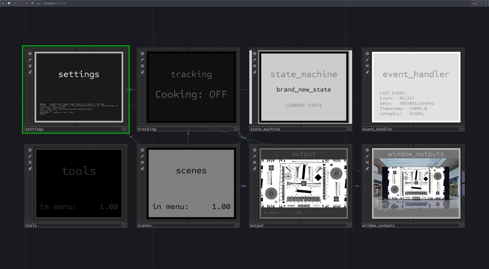

*Vista general del proyecto (Febrero 2025)*

Me he enfocado en el desarrollo continuo de un sistema más confiable y estructurado. 

Ante el desconocimiento de mejores prácticas para desarrollar con TouchDesigner comencé el proyecto proyecto con escenas monolíticas que **requerían en algún punto, alguna incidencia del desarrollador para adaptarla.** Precisamente yo planteo que es este es el principal problema a solucionar.

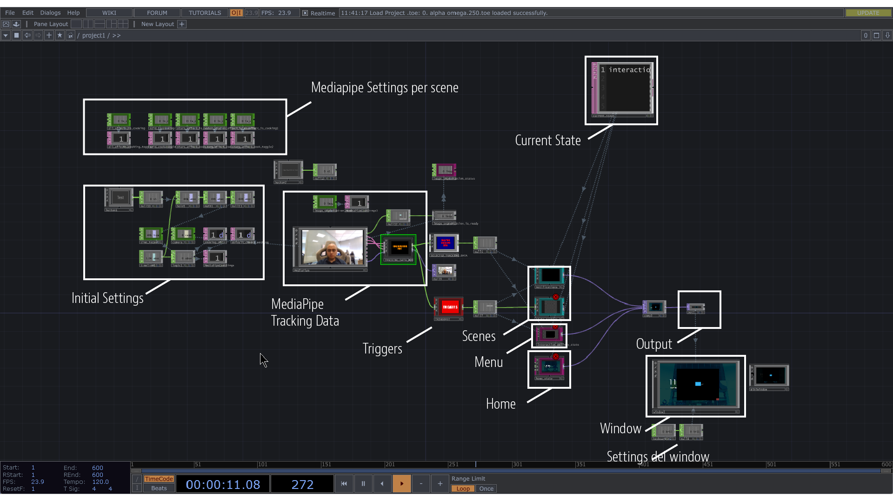

*Vista general anterior del proyecto (Nov 2024)*

Poco a poco se han ido desarrollando tanto escenas como mejores prácticas de desarrollo de software que permiten tener un mayor control y efectividad al momento de desarrollar nuevas escenas al sistema para implementarse localmente y (a plazo) reproducirlo a mayor escala.

Este desarrollo con el tiempo ha suponido la reestructuración y generación de módulos principales con las siguientes funciones:

### **Settings**

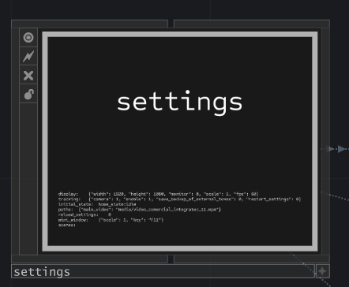

Un módulo de ajustes que permite el setupeo de los settings al momento de cargar el proyecto, e inclusive, en vivo. Permite seleccionar el monitor , resolución mediante la sola modificación de un **JSON** exterior que podría llegar a ser modificable de manera remota.

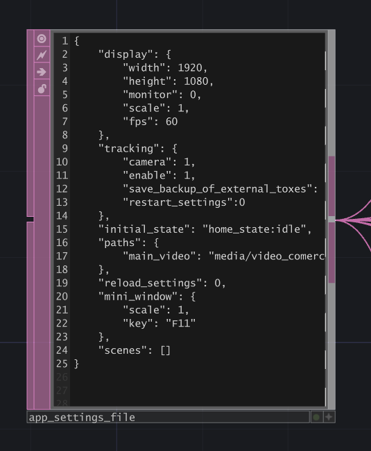

### **State machine**

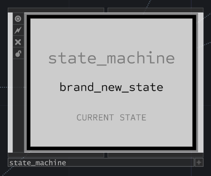

Una máquina de estados que permite determinar las escenas y separa cada momento del sistema: `initial` (vacío), `home`, `scene`, `menu`.

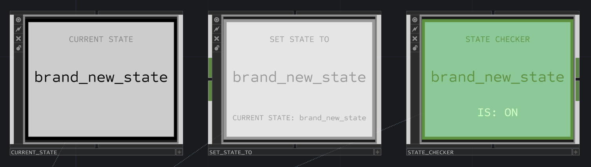

*Tools para trabajar con la máquina de estados*

### **Tracking**

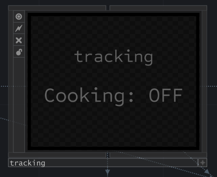

Módulo que alberga la lógica y ajustes de los sistemas de trackeo: MediaPipe, Ultraleap, Keyboard/Mouse, etc...

### **Event Handler**

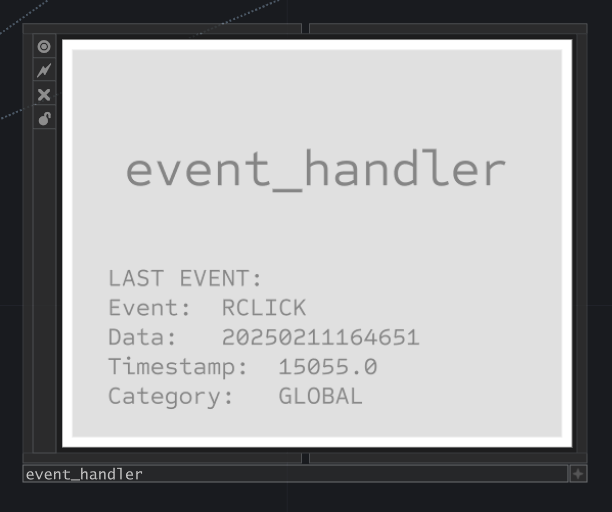

Que sirve como bus de datos para la *publicación* de eventos como SWIPE_RIGHT, RCLICK, SCROLL, OPEN_PALM, etc... El módulo designa el destino de los eventos: hacia el sistema `GLOBAL` o hacia la escena (de manera `LOCAL`).

### **Scenes**

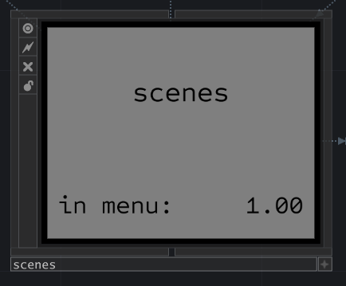

Módulo que alberga cada escena. `HOME`, `PARTICLES`, `STARS`, `...`. Cada una de ellas con una estructura normalizada.

### **Scene (prototype)**

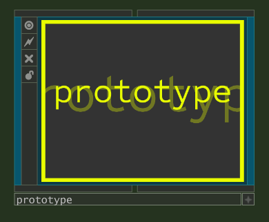 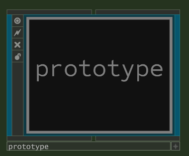

*Escena `prototype` plantilla para adaptar las escenas. Modo **Enabled y Disabled** respectivamente*

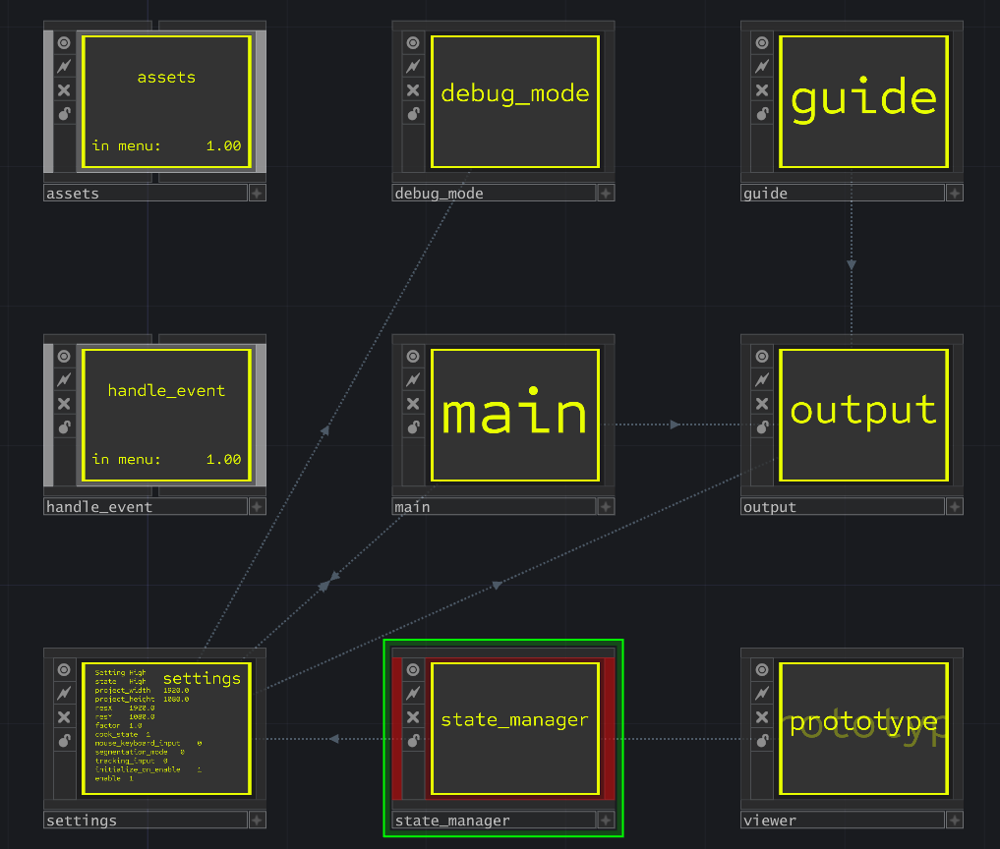

Cada escena se produce como un módulo externo `.tox` que se puede cargar dinámicamente como parte del JSON de settings. Se ha generado un prototipo [un template] con la siguiente estructura:

- **Input**. Con el recibidor del **Event Handler** así como de otros datos del tracking como posiciones, teclazos, clicks.

- **Assets.** Con los recursos necesarios para cada escena. Tomados de una carpeta adyacente al root de la escena.

- **Local Machine State**. Gestor de los diferentes estados locales de cada escena. P. Ej. `WELCOME_SCREEN`, `PLAYING`, `IDLE`, `PAUSE`.

- **Main**. Con la lógica interna de la escena.

- **Settings**. Con ajustes dependiendo del caso y uso de la escena. 
  
  - Apaga el Main cuando no está en uso, para optimizar recursos.
  
  - Puede colocarlo en modo `Mid`, con ajustes para equipos modestos y `Full `cuando los recursos sean amplios.
  
  - Hace ajustes al modo de reconocimiento o segmentación de la imagen del Tracking MediaPipe.

- **Guide.** Apartado para la lógica y elementos gráficos de interfaz para mostrar un display de instrucciones y apoyo al usuario, dependiendo de los Eventos del usuario y guiarlo a través de las experiencias.

- **Output.**
  
  - Módulo encargado de la lógica de la composición en capas de la guía visual, como de la experiencia. 
  
  - Output general que se añade al menú de escenas.

### Tools

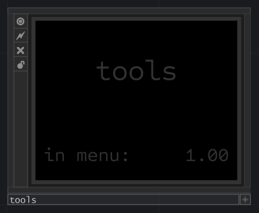

Módulo que contiene diversas herramientas de desarrollo o producción.

### Output

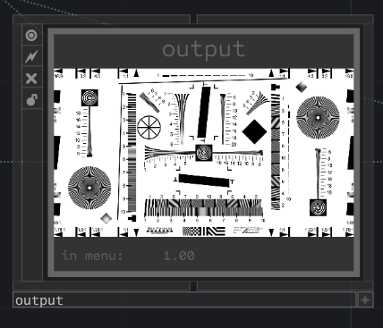

Módulo encargado de recibir y apilar en el árbol de outputs las diversas fuentes de datos gráficos generales en el siguiente orden (ymmv):

- Log

- Panic scene

- Animaciones de menú global

- Home

- Escenas

El output final de este módulo se manda a la respectiva Window (En el window outputs).

### Window Outputs

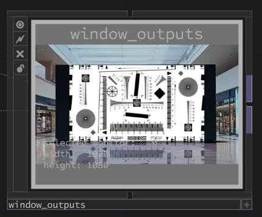

Módulo encargado de gestionar las Windows general y el mini viewer usado en desarrollo.
