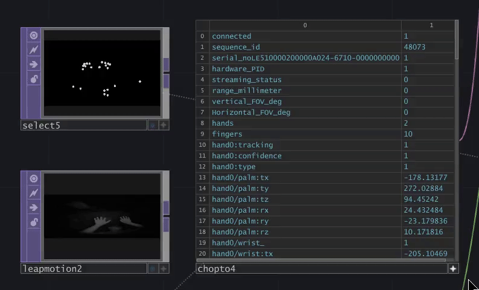

## Ultraleap




```csv
connected	1
sequence_id	45922
serial_noLE510000200000A024-6710-0000000000	1
hardware_PID	1
streaming_status	0
range_millimeter	0
vertical_FOV_deg	0
Horizontal_FOV_deg	0
hands	2
fingers	10
hand0:tracking	1
hand0:confidence	1
hand0:type	1
hand0/palm:tx	-189.14578
hand0/palm:ty	280.6595
hand0/palm:tz	98.153465
hand0/palm:rx	48.673813
hand0/palm:ry	-30.139677
hand0/palm:rz	13.09237
hand0/wrist_	1
hand0/wrist:tx	-209.44159
hand0/wrist:ty	229.16583
hand0/wrist:tz	134.37396
hand0/elbow:tracking	1
hand0/elbow:tx	-313.0227
hand0/elbow:ty	58.85656
hand0/elbow:tz	257.04587
hand0/elbow:rx	46.055492
hand0/elbow:ry	-40.953182
hand0/elbow:rz	0.9740025
hand0:vx	39.12668
hand0:vy	-14.611145
hand0:vz	5.4025865
hand0:pinch	0
hand0:grab	0
hand0/thumb:tracking	1
hand0/thumb:tx	-109.94995
hand0/thumb:ty	283.54437
hand0/thumb:tz	105.00093
hand0/thumb_nml:tx	-109.433105
hand0/thumb_nml:ty	282.9866
hand0/thumb_nml:tz	104.351494
hand0/index_finger:tracking	1
hand0/index_finger:tx	-155.00691
hand0/index_finger:ty	354.90506
hand0/index_finger:tz	70.388916
hand0/index_finger_nml:tx	-154.49007
hand0/index_finger_nml:ty	354.3473
hand0/index_finger_nml:tz	69.73948
hand0/middle_finger:tracking	1
hand0/middle_finger:tx	-180.107
hand0/middle_finger:ty	352.79593
hand0/middle_finger:tz	41.321556
hand0/middle_finger_nml:tx	-179.59015
hand0/middle_finger_nml:ty	352.23816
hand0/middle_finger_nml:tz	40.67212
hand0/ring_finger:tracking	1
hand0/ring_finger:tx	-204.14113
hand0/ring_finger:ty	333.0484
hand0/ring_finger:tz	32.930347
hand0/ring_finger_nml:tx	-203.62428
hand0/ring_finger_nml:ty	332.49063
hand0/ring_finger_nml:tz	32.28091
hand0/pinky_finger:tracking	1
hand0/pinky_finger:tx	-221.59946
hand0/pinky_finger:ty	311.53564
hand0/pinky_finger:tz	39.854294
hand0/pinky_finger_nml:tx	-221.08261
hand0/pinky_finger_nml:ty	310.97787
hand0/pinky_finger_nml:tz	39.204857
hand1:tracking	1
hand1:confidence	1
hand1:type	2
hand1/palm:tx	84.670364
hand1/palm:ty	266.95044
hand1/palm:tz	108.70065
hand1/palm:rx	47.168404
hand1/palm:ry	14.016288
hand1/palm:rz	-17.616123
hand1/wrist_	1
hand1/wrist:tx	90.475815
hand1/wrist:ty	218.04291
hand1/wrist:tz	153.12096
hand1/elbow:tracking	1
hand1/elbow:tx	138.45714
hand1/elbow:ty	45.886745
hand1/elbow:tz	305.25436
hand1/elbow:rx	44.550735
hand1/elbow:ry	24.55114
hand1/elbow:rz	-7.309719
hand1:vx	48.2172
hand1:vy	1.5071026
hand1:vz	10.464886
hand1:pinch	0
hand1:grab	0
hand1/thumb:tracking	1
hand1/thumb:tx	17.116016
hand1/thumb:ty	282.02795
hand1/thumb:tz	83.404434
hand1/thumb_nml:tx	16.740982
hand1/thumb_nml:ty	281.43375
hand1/thumb_nml:tz	82.69292
hand1/index_finger:tracking	1
hand1/index_finger:tx	66.492615
hand1/index_finger:ty	341.68445
hand1/index_finger:tz	65.041084
hand1/index_finger_nml:tx	66.11758
hand1/index_finger_nml:ty	341.09024
hand1/index_finger_nml:tz	64.32957
hand1/middle_finger:tracking	1
hand1/middle_finger:tx	97.21391
hand1/middle_finger:ty	327.07407
hand1/middle_finger:tz	42.505287
hand1/middle_finger_nml:tx	96.838875
hand1/middle_finger_nml:ty	326.47986
hand1/middle_finger_nml:tz	41.793766
hand1/ring_finger:tracking	1
hand1/ring_finger:tx	124.40141
hand1/ring_finger:ty	302.94562
hand1/ring_finger:tz	44.267002
hand1/ring_finger_nml:tx	124.026375
hand1/ring_finger_nml:ty	302.3514
hand1/ring_finger_nml:tz	43.55548
hand1/pinky_finger:tracking	1
hand1/pinky_finger:tx	129.47394
hand1/pinky_finger:ty	267.94818
hand1/pinky_finger:tz	49.952343
hand1/pinky_finger_nml:tx	129.0989
hand1/pinky_finger_nml:ty	267.35397
hand1/pinky_finger_nml:tz	49.24082
```
